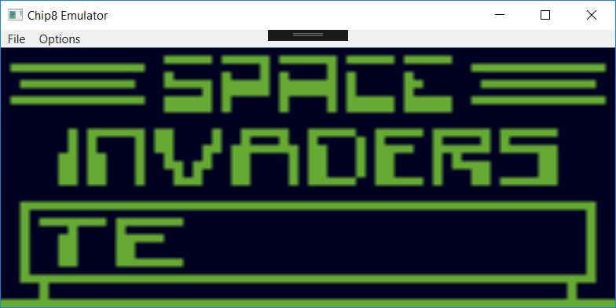
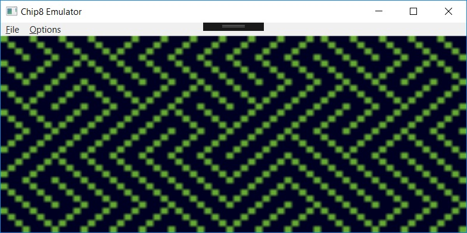
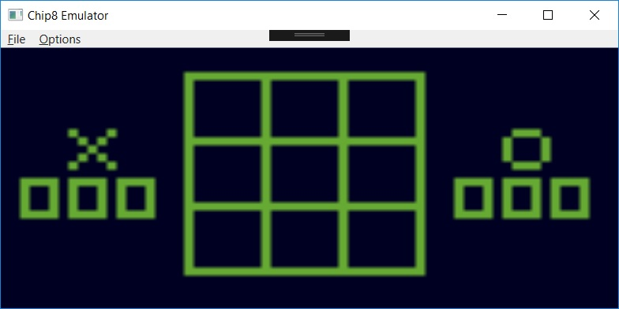
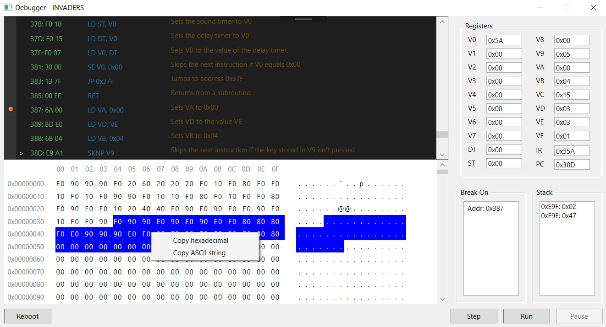
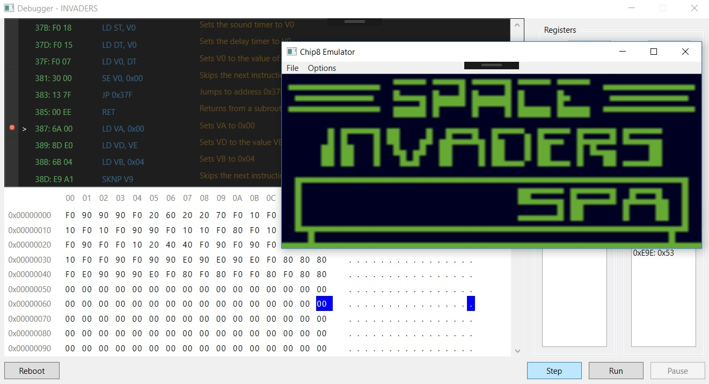
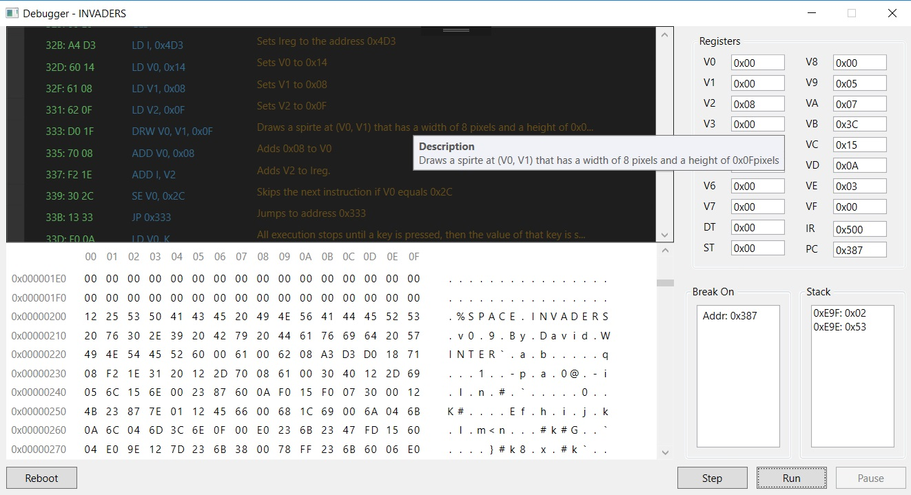

# Chip8Emulator
Chip8 Emulation and Disassembler

A Chip8 emulator written in C# using WPF framework. Sound and debugger not implemented as of yet. Motivation for this project is to gain a greater understanding on how computers work and how to write a functioning debugger/dissembler.

Things to still do:

* Allow the user to alter key inputs.
* Fix bugs with certain roms.
* Sound.
* Save States/ Load States.

## Screenshots

###  Dissambler / Cpu Viewer / Ram Viewer / ROM Debugging Options

To get the most accurate disassembly of the code as possible, A recursive traversal algorithm was used. Of-course, a known disadvantage with this type of algorithm is when attempting to decode indirect branch instructions like 1NNN and 2NNN due to the address being jumped to only being known at run-time. I have yet to figure out how i'm going to approach this problem.

As for the interface, the user can set multiple breakpoints within the Disassembler window to halt the execution of the emulator. While The CPU Viewer and Ram Viewer sections enable the user to view the registers, Chip 8 ram data, and the call stack -- each one being read only. The user can also interact with the debugger by pausing the execution of the rom, resetting the execution of the rom, or performing single step executions when the rom is in a paused state.

# Reference Sites:

* Chip 8 instruction set (including superchip instructions):  http://www.multigesture.net/wp-content/uploads/mirror/goldroad/chip8_instruction_set.shtml
